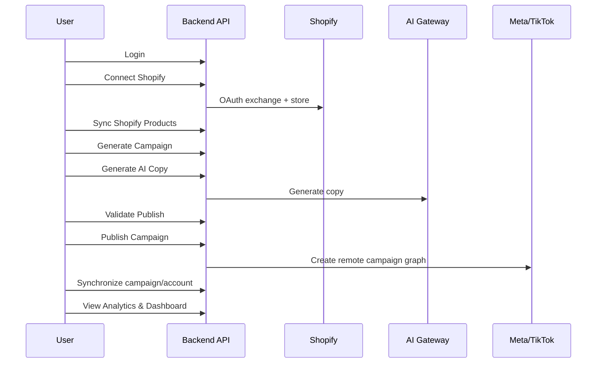
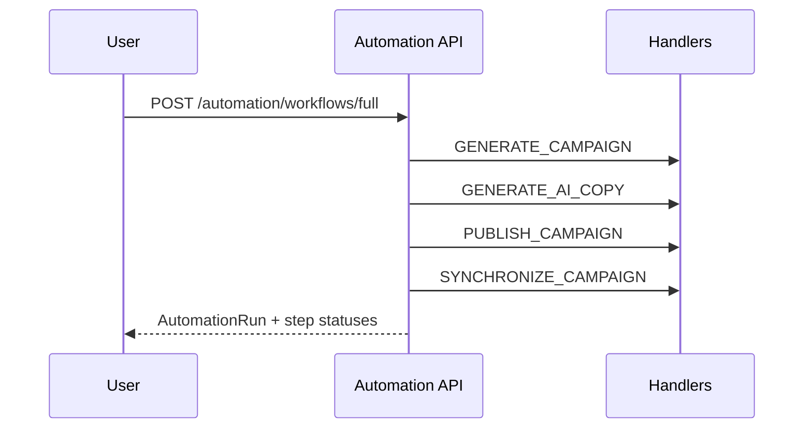
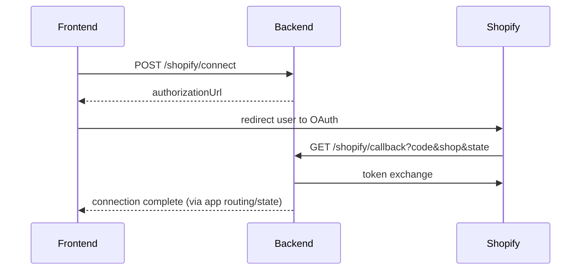

# Frontend Integration Guide

## Table of Contents

- [1. Project Overview](#1-project-overview)
- [2. Authentication](#2-authentication)
- [3. Organizations](#3-organizations)
- [4. Users](#4-users)
- [5. Invitations](#5-invitations)
- [6. Platform Connections](#6-platform-connections)
- [7. Shopify](#7-shopify)
- [8. Campaign Generator](#8-campaign-generator)
- [9. Campaigns](#9-campaigns)
- [10. Ad Sets](#10-ad-sets)
- [11. Ads](#11-ads)
- [12. Creatives](#12-creatives)
- [13. Storage](#13-storage)
- [14. AI Copy](#14-ai-copy)
- [15. Publisher](#15-publisher)
- [16. Synchronization](#16-synchronization)
- [17. Automation](#17-automation)
- [18. Analytics](#18-analytics)
- [19. Dashboard](#19-dashboard)
- [20. Common DTOs](#20-common-dtos)
- [21. Enums](#21-enums)
- [22. Error Responses](#22-error-responses)
- [23. Pagination](#23-pagination)
- [24. Response Format](#24-response-format)
- [25. File Upload Flow](#25-file-upload-flow)
- [26. Complete User Flows](#26-complete-user-flows)
- [27. Frontend Implementation Notes](#27-frontend-implementation-notes)
- [28. OpenAPI Cross Check](#28-openapi-cross-check)
- [29. Final Checklist](#29-final-checklist)

---

## 1. Project Overview

### System purpose
Advertising Operating System backend provides end-to-end APIs for:
- Authentication + organization membership
- Shopify product integration
- Campaign graph creation (campaigns/ad sets/ads/creatives)
- AI copy generation
- Publishing to Meta and TikTok
- Synchronization of platform state/metrics
- Automation workflow execution
- Analytics, reporting, and dashboard aggregation

### Backend architecture overview
- Framework: NestJS (`apps/api`)
- Data layer: Prisma + PostgreSQL
- API prefix: `/api`
- Global response interceptor wraps success payloads
- Global exception filter wraps errors with a unified envelope
- Validation: global `ValidationPipe` (`whitelist`, `forbidNonWhitelisted`, `transform`)

### Authentication model
- JWT bearer auth for protected routes
- Refresh token flow with server-side hashed refresh token storage
- JWT payload includes `sub`, `email`, `organizationId`, `role`
- `JwtStrategy.validate()` enforces active user and organization membership

### Organization model
- Multi-tenant by `organizationId`
- Most service queries scoped to authenticated user's `organizationId`
- Membership relation drives authorization

### Permission model
- Roles enum: `OWNER`, `ADMIN`, `MANAGER`, `MEMBER`, `VIEWER`
- Guards: `JwtAuthGuard` + `RolesGuard`
- Most read endpoints: `OWNER/ADMIN/MEMBER`
- Most write endpoints: `OWNER/ADMIN`
- Public exceptions: auth public routes, health, Shopify OAuth callback

---

## 2. Authentication

> Forgot/reset password endpoints are **not implemented** in current backend.

### 2.1 Register
- **Method:** `POST`
- **URL:** `/api/auth/register`
- **Auth required:** No (`@Public`)
- **Request DTO:** `RegisterDto`
  - `organizationName: string` (2-100)
  - `email: email`
  - `firstName: string` (2-100)
  - `lastName: string` (2-100)
  - `password: string` (8-100, must include upper+lower+number)
- **Response DTO:** not explicitly decorated; runtime shape:
  - `success: true`
  - `data.user`
  - `data.organization`
  - `data.membership`
  - `data.tokens` (`accessToken`, `refreshToken`)
- **Validation:** class-validator decorators on `RegisterDto`
- **Errors:** 400 validation, 409 duplicate email/slug, 500
- **Example request:**
```json
{
  "organizationName": "Acme Ads",
  "email": "owner@acme.com",
  "firstName": "Ava",
  "lastName": "Owner",
  "password": "Secure123"
}
```
- **Example response:**
```json
{
  "success": true,
  "data": {
    "success": true,
    "data": {
      "user": {
        "id": "uuid",
        "email": "owner@acme.com",
        "firstName": "Ava",
        "lastName": "Owner",
        "status": "ACTIVE",
        "createdAt": "2026-07-28T00:00:00.000Z"
      },
      "organization": {
        "id": "org_id",
        "name": "Acme Ads",
        "slug": "acme-ads",
        "createdAt": "2026-07-28T00:00:00.000Z"
      },
      "membership": {
        "id": "membership_id",
        "role": "OWNER"
      },
      "tokens": {
        "accessToken": "jwt",
        "refreshToken": "jwt"
      }
    }
  }
}
```

### 2.2 Login
- **Method:** `POST`
- **URL:** `/api/auth/login`
- **Auth required:** No (`@Public`)
- **Request DTO:** `LoginDto`
  - `email: email`
  - `password: string` (8-100)
- **Response DTO:** same runtime shape as register auth payload
- **Validation:** class-validator on `LoginDto`
- **Errors:** 401 invalid credentials, 401 no membership, 400 validation
- **Example request:**
```json
{ "email": "owner@acme.com", "password": "Secure123" }
```
- **Example response:** same shape as register success payload

### 2.3 Refresh token
- **Method:** `POST`
- **URL:** `/api/auth/refresh`
- **Auth required:** No (`@Public`)
- **Request DTO:** `RefreshDto`
  - `refreshToken: string` (JWT)
- **Response DTO:** runtime shape:
  - `success: true`
  - `data.tokens.accessToken`
  - `data.tokens.refreshToken`
- **Validation:** class-validator JWT constraint
- **Errors:**
  - 401 invalid refresh token
  - 401 inactive user
  - 401 membership no longer exists
- **Example request:**
```json
{ "refreshToken": "jwt" }
```
- **Example response:**
```json
{
  "success": true,
  "data": {
    "success": true,
    "data": {
      "tokens": {
        "accessToken": "jwt",
        "refreshToken": "jwt"
      }
    }
  }
}
```

### 2.4 Logout
- **Method:** `POST`
- **URL:** `/api/auth/logout`
- **Auth required:** Yes (`JwtAuthGuard`)
- **Request DTO:** none
- **Response DTO:** runtime success envelope
- **Behavior:** clears stored refresh token hash
- **Errors:** 401 invalid JWT
- **Example request:** empty body with bearer token
- **Example response:** `{ "success": true, "data": { ... } }`

### 2.5 Current user
- **Method:** `GET`
- **URL:** `/api/auth/me`
- **Auth required:** Yes (`JwtAuthGuard`)
- **Request DTO:** none
- **Response DTO:** runtime auth data shape (`user`, `organization`, `membership`)
- **Errors:** 401 invalid JWT / user invalid

### 2.6 Switch organization
- **Method:** `POST`
- **URL:** `/api/auth/switch-organization`
- **Auth required:** Yes (`JwtAuthGuard`)
- **Request DTO:** `SwitchOrganizationDto`
  - `organizationId: uuid`
- **Response DTO:** runtime shape with selected org, membership, and rotated tokens
- **Errors:** 401 no membership in target org

### 2.7 Forgot/reset password
- **Forgot Password:** not implemented
- **Reset Password:** not implemented

---

## 3. Organizations

> Implemented organization endpoints are current-org/member management only.
> `POST /organizations`, `GET /organizations` (collection), and org delete endpoints are not implemented.

| Method | URL | Auth | Roles | Request DTO | Response DTO |
|---|---|---|---|---|---|
| GET | `/api/organizations/current` | JWT | `VIEWER` | none | implicit runtime object |
| PATCH | `/api/organizations/current` | JWT | `OWNER` | `UpdateOrganizationDto` | implicit runtime object |
| GET | `/api/organizations/members` | JWT | `VIEWER` | none | implicit list |
| PATCH | `/api/organizations/members/:membershipId/role` | JWT | `ADMIN` | `UpdateMemberRoleDto` | implicit |
| DELETE | `/api/organizations/members/:membershipId` | JWT | `ADMIN` | none | implicit |

Validation:
- `UpdateOrganizationDto`: optional `name` and `slug` format (`^[a-z0-9-]+$`)
- `UpdateMemberRoleDto`: `role` enum

---

## 4. Users

| Method | URL | Auth | Roles | Request DTO | Response DTO |
|---|---|---|---|---|---|
| GET | `/api/users/me` | JWT | `OWNER/ADMIN/MEMBER` | none | implicit user response |
| PATCH | `/api/users/me` | JWT | `OWNER/ADMIN/MEMBER` | `UpdateUserDto` | implicit user response |

`UpdateUserDto` supports profile edits (`firstName`, `lastName`, `jobTitle`, `bio`, `avatarUrl`, `phone`, `timezone`, `language`).

---

## 5. Invitations

| Method | URL | Auth | Roles | Request DTO | Response DTO |
|---|---|---|---|---|---|
| POST | `/api/organizations/:organizationId/invitations` | JWT | `OWNER/ADMIN` | `CreateInvitationDto` | implicit invitation |
| POST | `/api/invitations/accept` | JWT | none | `AcceptInvitationDto` | implicit acceptance result |

Validation:
- `CreateInvitationDto`: `email`, `role`
- `AcceptInvitationDto`: non-empty `token`

---

## 6. Platform Connections

Covers generic platform connection records (`META`, `TIKTOK`, `SHOPIFY`, etc.).

| Method | URL | Auth | Roles | Request DTO | Response DTO |
|---|---|---|---|---|---|
| POST | `/api/platform-connections` | JWT | `OWNER/ADMIN` | `CreatePlatformConnectionDto` | `PlatformConnectionResponseDto` |
| GET | `/api/platform-connections` | JWT | `OWNER/ADMIN/MEMBER` | `PlatformConnectionQueryDto` | paginated connections |
| GET | `/api/platform-connections/:id` | JWT | `OWNER/ADMIN/MEMBER` | none | `PlatformConnectionResponseDto` |
| PATCH | `/api/platform-connections/:id` | JWT | `OWNER/ADMIN` | `UpdatePlatformConnectionDto` | `PlatformConnectionResponseDto` |
| DELETE | `/api/platform-connections/:id` | JWT | `OWNER/ADMIN` | none | no-content semantic (runtime default 200) |

Token lifecycle is handled by `platform-credentials` endpoints and Shopify OAuth callback.

---

## 7. Shopify

### Endpoints

| Method | URL | Auth | Roles | Request DTO | Response DTO |
|---|---|---|---|---|---|
| POST | `/api/shopify/connect` | JWT | `OWNER/ADMIN` | `ConnectShopifyDto` | `{ authorizationUrl }` |
| GET | `/api/shopify/callback` | Public | none | `ShopifyCallbackDto` (query) | void/success |
| GET | `/api/shopify/store` | JWT | `OWNER/ADMIN/MEMBER` | none | store object |
| POST | `/api/shopify/sync` | JWT | `OWNER/ADMIN` | none | sync summary |
| DELETE | `/api/shopify/disconnect` | JWT | `OWNER/ADMIN` | none | success |

### OAuth flow
1. FE calls `/shopify/connect` with `shopDomain`.
2. Redirect user to returned `authorizationUrl`.
3. Shopify calls backend `/shopify/callback` with `code/shop/state`.
4. Backend verifies signed state and exchanges token.
5. Backend upserts platform connection + credentials.

### Token lifecycle
- Access token stored encrypted in platform credentials.
- Connection status and sync status tracked in `PlatformConnection`.

### Connected/disconnected status
- Connected: `ConnectionStatus.ACTIVE`
- Disconnect endpoint marks state inactive/disconnected.

---

## 8. Campaign Generator

| Method | URL | Auth | Roles | Request DTO | Response DTO |
|---|---|---|---|---|---|
| POST | `/api/campaign-generator/generate` | JWT | `OWNER/ADMIN` | `GenerateCampaignDto` | `GenerateCampaignResponseDto` |

### Inputs
- Product, countries, platforms, budget, language, marketing goal, account mapping

### Outputs
- Arrays of generated campaign/ad-set/ad/creative IDs and summary fields

### Workflow
- Validates platform support and ad account ownership
- Reads Shopify product/store context
- Creates entities via existing domain services
- On failure, compensating rollback soft-deletes generated entities

---

## 9. Campaigns

| Method | URL | Auth | Roles | Request DTO | Response DTO |
|---|---|---|---|---|---|
| POST | `/api/campaigns` | JWT | `OWNER/ADMIN` | `CreateCampaignDto` | `CampaignResponseDto` |
| GET | `/api/campaigns` | JWT | `OWNER/ADMIN/MEMBER` | `CampaignQueryDto` | `PaginatedResponseDto<CampaignResponseDto>` |
| GET | `/api/campaigns/:id` | JWT | `OWNER/ADMIN/MEMBER` | none | `CampaignResponseDto` |
| PATCH | `/api/campaigns/:id` | JWT | `OWNER/ADMIN` | `UpdateCampaignDto` | `CampaignResponseDto` |
| DELETE | `/api/campaigns/:id` | JWT | `OWNER/ADMIN` | none | void |

Supports filtering, sorting, and pagination via `CampaignQueryDto`.

---

## 10. Ad Sets

| Method | URL | Auth | Roles | Request DTO | Response DTO |
|---|---|---|---|---|---|
| POST | `/api/ad-sets` | JWT | `OWNER/ADMIN` | `CreateAdSetDto` | `AdSetResponseDto` |
| GET | `/api/ad-sets` | JWT | `OWNER/ADMIN/MEMBER` | `FindAllAdSetsDto` | `PaginatedResponseDto<AdSetResponseDto>` |
| GET | `/api/ad-sets/:id` | JWT | `OWNER/ADMIN/MEMBER` | none | `AdSetResponseDto` |
| PATCH | `/api/ad-sets/:id` | JWT | `OWNER/ADMIN` | `UpdateAdSetDto` | `AdSetResponseDto` |
| DELETE | `/api/ad-sets/:id` | JWT | `OWNER/ADMIN` | none | void |

Notes:
- Update DTO intentionally omits mutable `campaignId`.
- Optimistic locking requires `version`.

---

## 11. Ads

| Method | URL | Auth | Roles | Request DTO | Response DTO |
|---|---|---|---|---|---|
| POST | `/api/ads` | JWT | `OWNER/ADMIN` | `CreateAdDto` | `AdResponseDto` |
| GET | `/api/ads` | JWT | `OWNER/ADMIN/MEMBER` | `AdQueryDto` | `PaginatedResponseDto<AdResponseDto>` |
| GET | `/api/ads/:id` | JWT | `OWNER/ADMIN/MEMBER` | none | `AdResponseDto` |
| PATCH | `/api/ads/:id` | JWT | `OWNER/ADMIN` | `UpdateAdDto` | `AdResponseDto` |
| DELETE | `/api/ads/:id` | JWT | `OWNER/ADMIN` | none | void |

---

## 12. Creatives

Includes creative CRUD + archive/restore.

| Method | URL | Auth | Roles | Request DTO | Response DTO |
|---|---|---|---|---|---|
| POST | `/api/creatives` | JWT | `OWNER/ADMIN` | `CreateCreativeDto` | `CreativeResponseDto` |
| GET | `/api/creatives` | JWT | `OWNER/ADMIN/MEMBER` | `CreativeQueryDto` | `PaginatedResponseDto<CreativeResponseDto>` |
| GET | `/api/creatives/:id` | JWT | `OWNER/ADMIN/MEMBER` | none | `CreativeResponseDto` |
| PATCH | `/api/creatives/:id` | JWT | `OWNER/ADMIN` | `UpdateCreativeDto` | `CreativeResponseDto` |
| DELETE | `/api/creatives/:id` | JWT | `OWNER/ADMIN` | none | void |
| PATCH | `/api/creatives/:id/archive` | JWT | `OWNER/ADMIN` | none | `CreativeResponseDto` |
| PATCH | `/api/creatives/:id/restore` | JWT | `OWNER/ADMIN` | none | `CreativeResponseDto` |

Creative types are enum-driven (`TEXT`, `IMAGE`, `VIDEO`, etc. from Prisma enum).

---

## 13. Storage

| Method | URL | Auth | Roles | Request DTO | Response DTO |
|---|---|---|---|---|---|
| POST | `/api/storage/upload` | JWT | `OWNER/ADMIN` | `UploadFileDto` (multipart) | `StorageResponseDto` |
| POST | `/api/storage/upload/multiple` | JWT | `OWNER/ADMIN` | `UploadMultipleFilesDto` (multipart) | `StorageResponseDto[]` |
| GET | `/api/storage/:id` | JWT | `OWNER/ADMIN/MEMBER` | none | `StorageResponseDto` |
| DELETE | `/api/storage/:id` | JWT | `OWNER/ADMIN` | none | void |

Validation and limits:
- File is required by `ParseFilePipe`.
- Creative-asset file validation service defines allowed types/extensions and max 100MB (used in creative-assets module).
- Storage endpoints themselves do not expose separate limit DTO fields.

---

## 14. AI Copy

| Method | URL | Auth | Roles | Request DTO | Response DTO |
|---|---|---|---|---|---|
| POST | `/api/ai-copy/generate` | JWT | `OWNER/ADMIN` | `GenerateAiCopyDto` | `GenerateAiCopyResponseDto` |

Behavior:
- Requires campaign + organization ownership.
- Uses template-driven AI generation.
- Retry-safe no-op updates when generated copy equals current persisted copy.
- Partial progress is intentionally persisted; retry can continue.

---

## 15. Publisher

### Endpoints

| Method | URL | Auth | Roles | Request DTO | Response DTO |
|---|---|---|---|---|---|
| GET | `/api/publisher/platforms` | JWT | `OWNER/ADMIN/MEMBER` | none | `PublisherPlatformsResponseDto` |
| POST | `/api/publisher/validate` | JWT | `OWNER/ADMIN/MEMBER` | `PublishCampaignDto` | `PublishValidationResponseDto` |
| POST | `/api/publisher/publish` | JWT | `OWNER/ADMIN` | `PublishCampaignDto` | `PublishCampaignResponseDto` |

### Dry run
- Controlled via request `options` flags in publisher payload.
- Validation endpoint provides non-mutating preflight checks.

### PublishJob + statuses
- Persisted `PublishJobStatus`: `PENDING`, `VALIDATING`, `PUBLISHING`, `COMPLETED`, `PARTIAL`, `FAILED`
- API `PublishStatus`: `PENDING`, `VALIDATED`, `PUBLISHED`, `PARTIAL`, `FAILED`, `SKIPPED`

### PARTIAL behavior (current implementation)
- If remote publish partially succeeds then fails:
  - Job is marked `PARTIAL`
  - API returns `PublishStatus.PARTIAL`
  - Published entities are recorded in result payload
  - Pending local external-ID writes are not flushed on failure (deterministic local state)

### Retry behavior
- Caller-driven retries
- Local failure semantics are deterministic; external platform side effects may already exist and should be reconciled via returned entity details.

---

## 16. Synchronization

### Endpoints

| Method | URL | Auth | Roles | Request DTO | Response DTO |
|---|---|---|---|---|---|
| POST | `/api/synchronization/campaign/:id` | JWT | `OWNER/ADMIN` | none | `SyncResultDto` |
| POST | `/api/synchronization/account/:id` | JWT | `OWNER/ADMIN` | none | `SyncResultDto` |
| GET | `/api/synchronization/status/:campaignId` | JWT | `OWNER/ADMIN/MEMBER` | none | `CampaignSyncStatusDto` |

### Status values
- `SyncStatus`: `SUCCESS`, `PARTIAL`, `FAILED`, `SKIPPED`
- `SyncChangeType`: includes `UPDATED`, `UNCHANGED`, `REMOTE_DELETED`, `NOT_PUBLISHED`, `FAILED`

### Partial/success semantics
- Success flag is derived from status (`SUCCESS`/`SKIPPED` only true)
- Timestamps are patched consistently:
  - successful/skipped -> `lastSuccessfulSyncAt`
  - partial/failed -> `lastFailedSyncAt`

### Retry behavior
- Manual retries by re-calling sync endpoints
- Persistence layer is idempotent for same-day snapshot grain via `uniqueKey` upsert

---

## 17. Automation

### Endpoints

| Method | URL | Auth | Roles | Request DTO | Response DTO |
|---|---|---|---|---|---|
| POST | `/api/automation/pipelines` | JWT | `OWNER/ADMIN` | `CreateAutomationPipelineDto` | `AutomationPipelineResponseDto` |
| GET | `/api/automation/pipelines` | JWT | `OWNER/ADMIN/MEMBER` | `AutomationPipelineQueryDto` | paginated pipelines |
| GET | `/api/automation/pipelines/:id` | JWT | `OWNER/ADMIN/MEMBER` | none | `AutomationPipelineResponseDto` |
| PATCH | `/api/automation/pipelines/:id` | JWT | `OWNER/ADMIN` | `UpdateAutomationPipelineDto` | `AutomationPipelineResponseDto` |
| DELETE | `/api/automation/pipelines/:id` | JWT | `OWNER/ADMIN` | none | void |
| POST | `/api/automation/pipelines/:id/run` | JWT | `OWNER/ADMIN` | `TriggerAutomationDto` | `AutomationRunResponseDto` |
| GET | `/api/automation/runs` | JWT | `OWNER/ADMIN/MEMBER` | `AutomationRunQueryDto` | paginated runs |
| GET | `/api/automation/runs/:id` | JWT | `OWNER/ADMIN/MEMBER` | none | `AutomationRunResponseDto` |
| POST | `/api/automation/workflows/campaign` | JWT | `OWNER/ADMIN` | `RunCampaignWorkflowDto` | `AutomationRunResponseDto` |
| POST | `/api/automation/workflows/publish` | JWT | `OWNER/ADMIN` | `RunPublishWorkflowDto` | `AutomationRunResponseDto` |
| POST | `/api/automation/workflows/full` | JWT | `OWNER/ADMIN` | `RunFullWorkflowDto` | `AutomationRunResponseDto` |
| GET | `/api/automation/workflows/:id` | JWT | `OWNER/ADMIN/MEMBER` | none | workflow status |

### Workflow states
- Run: `PENDING`, `RUNNING`, `COMPLETED`, `FAILED`, `CANCELLED`
- Step: `PENDING`, `RUNNING`, `COMPLETED`, `FAILED`, `SKIPPED`

### Validation
- Actions must map to registered handlers; unsupported action types are rejected.

---

## 18. Analytics

### Endpoints

| Method | URL | Auth | Roles | Request DTO | Response DTO |
|---|---|---|---|---|---|
| GET | `/api/analytics` | JWT | `OWNER/ADMIN/MEMBER` | `AnalyticsQueryDto` | list summary object |
| GET | `/api/analytics/dashboard` | JWT | `OWNER/ADMIN/MEMBER` | `AnalyticsQueryDto` | dashboard analytics object |
| GET | `/api/analytics/summary` | JWT | `OWNER/ADMIN/MEMBER` | `AnalyticsQueryDto` | summary object |
| GET | `/api/analytics/timeseries` | JWT | `OWNER/ADMIN/MEMBER` | `AnalyticsQueryDto` | timeseries object |
| GET | `/api/analytics/breakdown` | JWT | `OWNER/ADMIN/MEMBER` | `AnalyticsBreakdownDto` | breakdown object |
| GET | `/api/analytics/export/csv` | JWT | `OWNER/ADMIN/MEMBER` | `AnalyticsQueryDto` | file stream |
| GET | `/api/analytics/export/xlsx` | JWT | `OWNER/ADMIN/MEMBER` | `AnalyticsQueryDto` | file stream |
| GET | `/api/analytics/export/pdf` | JWT | `OWNER/ADMIN/MEMBER` | `AnalyticsQueryDto` | file stream |
| GET | `/api/analytics/:id` | JWT | `OWNER/ADMIN/MEMBER` | none | `AnalyticsResponseDto` |

Notes:
- Export endpoints use `@Res()` and return attachment streams.

---

## 19. Dashboard

| Method | URL | Auth | Roles | Response DTO |
|---|---|---|---|---|
| GET | `/api/dashboard` | JWT | `OWNER/ADMIN/MEMBER` | `DashboardSummaryDto` |
| GET | `/api/dashboard/analytics` | JWT | `OWNER/ADMIN/MEMBER` | `AnalyticsSummaryDto` |
| GET | `/api/dashboard/campaigns` | JWT | `OWNER/ADMIN/MEMBER` | `CampaignSummaryDto` |
| GET | `/api/dashboard/automation` | JWT | `OWNER/ADMIN/MEMBER` | `AutomationSummaryDto` |
| GET | `/api/dashboard/platforms` | JWT | `OWNER/ADMIN/MEMBER` | `PlatformsSummaryDto` |
| GET | `/api/dashboard/recent` | JWT | `OWNER/ADMIN/MEMBER` | `RecentActivityDto` |

Returned structure is composed DTOs from `dashboard-response.dto.ts`.

---

## 20. Common DTOs

### Shared pagination DTOs
- `BaseQueryDto`: `page`, `limit`, optional `search`
- `PaginationMetaDto`: `{ page, limit, total, totalPages, hasNextPage, hasPreviousPage }`
- `PaginatedResponseDto<T>`: `{ data: T[], meta: PaginationMetaDto }`

### Common response wrappers
- Success envelope: `success + data` (global interceptor)
- Error envelope: `success:false + statusCode + timestamp + path + message + correlationId`

### Complete DTO inventory
- Backend currently includes **99 DTO classes/files** under `apps/api/src` (module-specific + common).
- All endpoint-bound DTOs are covered in sections 2-19 and referenced by name exactly as implemented.

---

## 21. Enums

### Frontend-relevant Prisma enums (from `schema.prisma`)
- `UserStatus`
- `MembershipRole`
- `InvitationStatus`
- `AuditAction`
- `AuditEntity`
- `PlatformType`
- `ConnectionStatus`
- `SyncStatus`
- `AdAccountStatus`
- `Currency`
- `CampaignStatus`
- `CampaignObjective`
- `CampaignBuyingType`
- `AdSetStatus`
- `AdStatus`
- `CreativeType`
- `CreativeAssetType`
- `CallToAction`
- `BillingEvent`
- `AnalyticsLevel`
- `ReportLevel`
- `ReportFormat`
- `ReportFrequency`
- `ShopifyProductStatus`
- `AutomationTriggerType`
- `AutomationActionType`
- `AutomationRunStatus`
- `AutomationStepStatus`
- `PublishJobStatus`
- plus additional backend enums not exposed directly to FE payloads

### TS enums used in API payloads
- `PublisherPlatform`
- `PublishStatus`
- `PublishEntityType`
- `SynchronizationPlatform`
- `SyncEntityType`
- `SyncStatus` (sync module enum)
- `SyncChangeType`
- `MarketingGoal`
- `ExportFormat`

---

## 22. Error Responses

Global error format:
```json
{
  "success": false,
  "statusCode": 400,
  "timestamp": "2026-07-28T12:00:00.000Z",
  "path": "/api/campaigns",
  "message": "Validation failed",
  "correlationId": "uuid-or-generated"
}
```

Common categories:
- Validation errors (400)
- Authentication errors (401)
- Authorization errors (403)
- Not found errors (404)
- Conflict errors (409)
- Server errors (500)

Business examples:
- Publisher invalid request -> 400 with issue list
- Sync unsupported platform -> 400
- Refresh invalid token/inactive user -> 401

---

## 23. Pagination

Standard pagination request fields:
- `page` (default 1)
- `limit` (default 20, max 100 on many query DTOs)
- optional query-specific filters/sort fields

Standard response meta:
```json
{
  "meta": {
    "page": 1,
    "limit": 20,
    "total": 87,
    "totalPages": 5,
    "hasNextPage": true,
    "hasPreviousPage": false
  }
}
```

---

## 24. Response Format

### Success
Most endpoints are wrapped by global interceptor:
```json
{
  "success": true,
  "data": { "...endpoint payload...": "..." }
}
```

### Failure
Global exception filter shape described in section 22.

### Metadata
Pagination metadata is embedded as `data.meta` for list endpoints that use `PaginatedResponseDto`.

---

## 25. File Upload Flow

1. FE sends multipart form to `/api/storage/upload` or `/api/storage/upload/multiple`.
2. Backend uploads binary to configured storage provider.
3. Backend persists `creativeAsset` metadata row.
4. If DB persistence fails, backend deletes uploaded blob (compensating cleanup).
5. FE receives `StorageResponseDto` with `id`, `url`, and metadata fields.

Lifecycle:
- Retrieve metadata: `GET /api/storage/:id`
- Remove asset: `DELETE /api/storage/:id` (soft delete semantics in asset record path)

---

## 26. Complete User Flows

### 26.1 Primary marketing workflow



### 26.2 Automation full workflow



### 26.3 Shopify OAuth flow



---

## 27. Frontend Implementation Notes

### General
- Use a single API client that always expects envelope `{ success, data }`.
- Centralize auth token refresh handling on 401.
- Send bearer token for protected endpoints.

### Module-level recommendations
- **Auth:** keep refresh flow silent in interceptor; hard-logout on refresh failure.
- **Campaign graph modules:** use optimistic updates only for local form state; prefer server-confirmed list refresh after write.
- **Shopify/Publisher/Sync/Automation:** treat as async operations; show progress states and retry actions.
- **Analytics/Dashboard:** cache short-lived (15-60s), support manual refresh.
- **Storage uploads:** show upload progress and post-upload metadata state.

### Polling recommendations
- `publisher/publish`: poll related workflow status (publish response + dashboard recent + sync status endpoints)
- `automation/runs/:id`: poll until terminal run status (`COMPLETED|FAILED|CANCELLED`)
- `synchronization/status/:campaignId`: poll after publish or sync triggers

### Error handling
- Render `message` from global error envelope.
- Preserve `correlationId` in UI/logging for support.

### Empty states
- No Shopify connection
- No products synced
- No campaigns
- No automation runs
- No analytics data in date range

---

## 28. OpenAPI Cross Check

Cross-check against current backend controllers:
- Controller files reviewed: **26**
- Endpoints documented: **117**
- Undocumented endpoint count: **0**
- Documented-not-implemented endpoints: **0**

Explicit non-existing APIs (requested but absent):
- Forgot password
- Reset password
- Organization create/delete/list collection endpoints

Status-code caveat:
- Some controllers annotate `204` in Swagger decorators without `@HttpCode(204)`; runtime default may remain 200. Frontend should not hard-fail on 200 vs 204 for delete routes.

---

## 29. Final Checklist

- [x] Every implemented endpoint documented
- [x] Authentication requirements documented
- [x] Permission model documented
- [x] Request DTOs documented per module
- [x] Response DTOs documented (explicit + runtime inferred where decorators absent)
- [x] Pagination format documented
- [x] Error envelope documented
- [x] Upload flow documented
- [x] Automation workflows documented
- [x] Publisher/Sync failure semantics documented
- [x] Mermaid sequence diagrams included
- [x] Missing requested-but-absent APIs explicitly called out

---

## Appendix A: Endpoint Count Summary by Module

- Auth: 6
- Organizations: 5
- Users: 2
- Invitations: 2
- Memberships: 4
- Audit Logs: 1
- Health: 1
- Platform Connections: 5
- Platform Credentials: 5
- Shopify: 5
- Campaign Generator: 1
- Campaigns: 5
- Ad Sets: 5
- Ads: 5
- Creatives: 7
- Creative Assets: 9
- Storage: 4
- AI: 1
- AI Copy: 1
- Publisher: 3
- Synchronization: 3
- Automation: 12
- Analytics: 9
- Reporting: 5
- Dashboard: 6

Total: **117**
