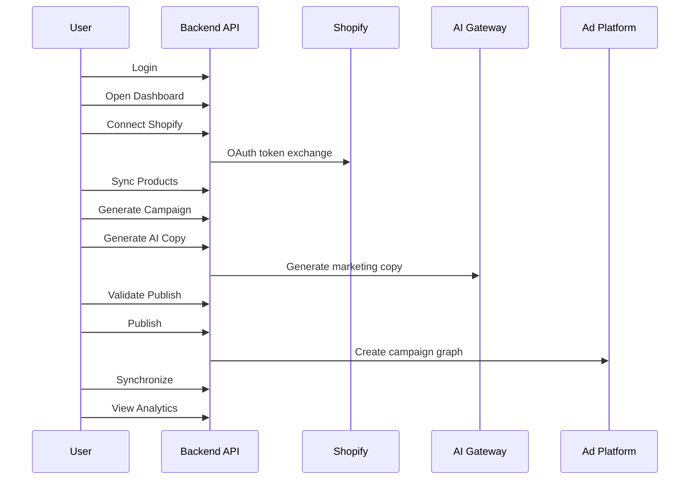
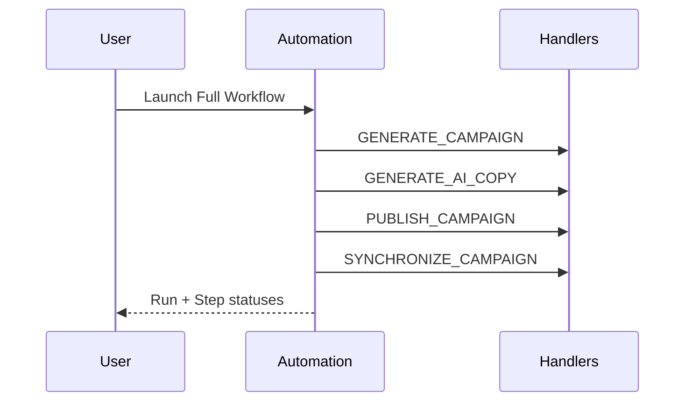
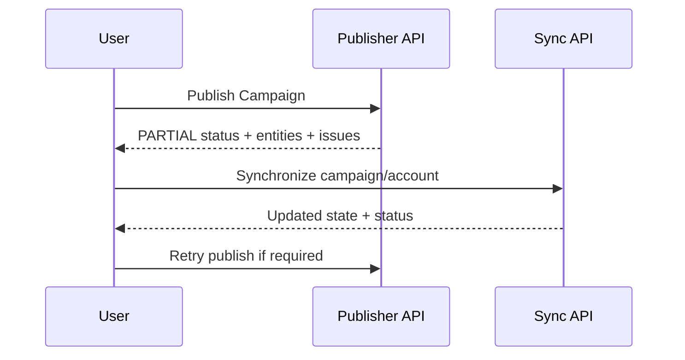

# Frontend Product Specification

## Table of Contents

- [1. Product Overview](#1-product-overview)
- [2. Application Structure](#2-application-structure)
- [3. Page Specifications](#3-page-specifications)
- [4. Dashboard](#4-dashboard)
- [5. Campaigns](#5-campaigns)
- [6. Campaign Generator](#6-campaign-generator)
- [7. AI Copy](#7-ai-copy)
- [8. Publisher](#8-publisher)
- [9. Automation](#9-automation)
- [10. Analytics](#10-analytics)
- [11. Storage](#11-storage)
- [12. Shopify](#12-shopify)
- [13. Platform Connections](#13-platform-connections)
- [14. Organizations](#14-organizations)
- [15. Settings](#15-settings)
- [16. User Flows](#16-user-flows)
- [17. Permissions Matrix](#17-permissions-matrix)
- [18. Design Requirements](#18-design-requirements)
- [19. Frontend Implementation Priority](#19-frontend-implementation-priority)
- [20. MVP Definition](#20-mvp-definition)
- [21. Final Checklist](#21-final-checklist)

---

## 1. Product Overview

### Product Vision
Advertising Operating System is a unified workspace where teams can connect commerce data, generate campaign structures, generate ad copy, publish to ad platforms, synchronize performance state, and monitor outcomes in one operational surface.

### Primary Users
- Growth teams in SMB/mid-market ecommerce brands.
- Agency account operators managing client ad operations.
- Owners/admins responsible for governance and publishing controls.

### User Roles
- `OWNER`: full tenant control and all high-risk actions.
- `ADMIN`: operational control for most workflows.
- `MEMBER`: read and selected operational actions where backend allows.
- `VIEWER`: currently limited usage in organization read surfaces.

### Business Goals
- Reduce time from product sync to live campaign.
- Standardize campaign creation and publication quality.
- Improve reliability and traceability across publish/sync/automation cycles.
- Provide role-safe collaboration across teams.

### Core Modules
- Authentication
- Organizations, Memberships, Invitations, Users
- Shopify and Platform Connections/Credentials
- Campaigns, Ad Sets, Ads, Creatives, Creative Assets, Storage
- Campaign Generator, AI Copy
- Publisher and Synchronization
- Automation
- Analytics, Reporting, Dashboard

### User Journey
User authenticates, connects Shopify, syncs products, generates campaign graph, generates copy, validates and publishes, synchronizes platform state, reviews analytics/dashboard, and operationalizes recurring flows with automation.

---

## 2. Application Structure

### Navigation Hierarchy

```text
Authentication
  - Login
  - Register

App Shell
  - Dashboard
  - Campaign Operations
    - Campaigns
      - Campaign List
      - Campaign Details
    - Campaign Generator
    - AI Copy
    - Publisher
    - Synchronization Status
  - Automation
    - Pipelines
    - Runs
    - Workflow Launcher
  - Analytics & Reporting
    - Analytics Overview
    - Analytics Exports
    - Reports
  - Assets
    - Creatives
    - Creative Assets
    - Storage
  - Integrations
    - Shopify
    - Platform Connections
    - Platform Credentials
    - Ad Accounts
  - Organization
    - Organization Profile
    - Members
    - Invitations
    - Memberships
  - Settings
    - Profile
    - Preferences
```

### Routing Model
- All authenticated pages require valid access token.
- Role-gated route access must mirror backend `@Roles`.
- Unavailable backend capability should not have navigable page actions (example: forgot/reset password).

---

## 3. Page Specifications

> Standard page contract for every page below includes:
> Purpose, business goal, permissions, entry, breadcrumb, actions, data, APIs, flow, validation, loading/empty/error/success, pagination/filter/sort/search, bulk actions, confirmation dialogs, notifications, responsive behavior.

### 3.1 Login Page
- **Purpose:** authenticate existing users.
- **Business goal:** fast, secure session start.
- **Required permissions:** public.
- **Navigation entry:** unauthenticated root.
- **Breadcrumb:** none.
- **Primary actions:** login submit.
- **Secondary actions:** go to register.
- **Data displayed:** form only.
- **API endpoints used:** `POST /api/auth/login`.
- **User flow:** submit credentials -> receive tokens -> route to dashboard.
- **Validation rules:** email format, password min/complexity feedback.
- **Loading state:** disable form + spinner.
- **Empty state:** not applicable.
- **Error state:** show 401/validation message.
- **Success state:** toast + redirect.
- **Pagination/filter/sort/search:** not applicable.
- **Bulk actions:** none.
- **Confirmation dialogs:** none.
- **Notifications:** login success/failure.
- **Responsive behavior:** centered card; mobile full-width.

### 3.2 Register Page
- **Purpose:** create org + owner account.
- **Business goal:** self-serve onboarding.
- **Permissions:** public.
- **Entry:** login secondary action.
- **Breadcrumb:** none.
- **Primary actions:** create account.
- **Secondary actions:** back to login.
- **Data displayed:** register form.
- **APIs:** `POST /api/auth/register`.
- **Flow:** submit -> account/org created -> authenticated session.
- **Validation:** organization name 2-100, password complexity.
- **States:** same pattern as login.
- **Responsive:** same as login.

### 3.3 Dashboard Page
- **Purpose:** consolidated operational health and quick actions.
- **Business goal:** reduce navigation hops and highlight bottlenecks.
- **Permissions:** `OWNER/ADMIN/MEMBER`.
- **Entry:** primary nav.
- **Breadcrumb:** `Dashboard`.
- **Primary actions:** navigate to campaign generator, publish, sync.
- **Secondary actions:** drill into widgets.
- **Data displayed:** dashboard summary, recent activity, platform status.
- **APIs:** `GET /api/dashboard`, plus optional granular `/analytics`, `/campaigns`, `/automation`, `/platforms`, `/recent`.
- **Flow:** load summary -> show widget cards -> click-through.
- **Validation:** query params (if any view options).
- **Loading:** skeleton widgets.
- **Empty:** no campaigns/integrations empty cards.
- **Error:** retry card with correlation-safe message.
- **Success:** refreshed timestamp.
- **Pagination/filter/sort/search:** recent lists may paginate client-side by small size.
- **Bulk actions:** none.
- **Confirmation:** none.
- **Notifications:** refresh success/failure.
- **Responsive:** stack widgets on tablet/mobile; keep KPI priority order.

### 3.4 Campaign List Page
- **Purpose:** manage campaign inventory.
- **Business goal:** efficient campaign lifecycle control.
- **Permissions:** view `OWNER/ADMIN/MEMBER`; mutate `OWNER/ADMIN`.
- **Entry:** Campaign Operations > Campaigns.
- **Breadcrumb:** `Campaigns`.
- **Primary actions:** create, open details.
- **Secondary actions:** edit, delete.
- **Data displayed:** paginated campaign table.
- **APIs:** `GET /api/campaigns`, `POST /api/campaigns`, `PATCH /api/campaigns/:id`, `DELETE /api/campaigns/:id`.
- **Flow:** list -> filter/search -> action.
- **Validation:** create/edit DTO constraints.
- **Loading:** table skeleton.
- **Empty:** no campaigns CTA to generator/manual create.
- **Error:** inline table error + retry.
- **Success:** row updates + toast.
- **Pagination/filter/sort/search:** backend-driven via query DTO.
- **Bulk actions:** not implemented backend; keep disabled.
- **Confirmations:** delete confirmation required.
- **Notifications:** create/update/delete result.
- **Responsive:** table to card rows on mobile.

### 3.5 Campaign Details Page
- **Purpose:** inspect and edit single campaign.
- **Business goal:** reduce mistakes before publish/sync.
- **Permissions:** view `OWNER/ADMIN/MEMBER`; edit/delete `OWNER/ADMIN`.
- **Entry:** campaign row click.
- **Breadcrumb:** `Campaigns / {Campaign}`.
- **Primary actions:** edit, sync trigger (via sync page action), publish navigation.
- **Secondary actions:** delete.
- **Data:** campaign core fields and linked account references.
- **APIs:** `GET /api/campaigns/:id`, `PATCH`, `DELETE`, `GET /api/synchronization/status/:campaignId`.
- **Flow:** load details -> mutate -> confirm.
- **Validation:** optimistic lock `version` handling.
- **States:** standard page states.

### 3.6 Ad Sets Page
- **Purpose:** list/manage ad sets for org/campaign context.
- **Business goal:** targeting/budget control.
- **Permissions:** read `OWNER/ADMIN/MEMBER`, write `OWNER/ADMIN`.
- **APIs:** `GET/POST /api/ad-sets`, `GET/PATCH/DELETE /api/ad-sets/:id`.
- **Pagination/filter/sort/search:** backend query supported.
- **Notes:** `campaignId` immutable in update contract.

### 3.7 Ads Page
- **Purpose:** list/manage ads linked to ad sets.
- **Business goal:** execution control at ad level.
- **Permissions:** read `OWNER/ADMIN/MEMBER`, write `OWNER/ADMIN`.
- **APIs:** `GET/POST /api/ads`, `GET/PATCH/DELETE /api/ads/:id`.
- **UX states:** as standard table+drawer/page detail.

### 3.8 Creatives Page
- **Purpose:** manage reusable creative records.
- **Business goal:** improve creative lifecycle and reuse.
- **Permissions:** read `OWNER/ADMIN/MEMBER`, write/archive/delete `OWNER/ADMIN`.
- **APIs:** `GET/POST /api/creatives`, `GET/PATCH/DELETE /api/creatives/:id`, `PATCH /archive`, `PATCH /restore`.
- **Filtering/search/sort:** use `CreativeQueryDto` fields.

### 3.9 Creative Assets Page
- **Purpose:** manage media assets and associations.
- **Business goal:** ensure publish-ready asset inventory.
- **Permissions:** read `OWNER/ADMIN/MEMBER`, write `OWNER/ADMIN`.
- **APIs:** creative-assets CRUD/upload/archive/restore/set-primary endpoints.
- **Bulk actions:** not available server-side; single-item actions only.

### 3.10 Storage Page
- **Purpose:** upload and retrieve storage-backed assets.
- **Business goal:** quick ingestion of files for creatives/ads.
- **Permissions:** upload/delete `OWNER/ADMIN`, read `OWNER/ADMIN/MEMBER`.
- **APIs:** `POST /api/storage/upload`, `POST /api/storage/upload/multiple`, `GET /api/storage/:id`, `DELETE /api/storage/:id`.
- **Validation:** file required; show backend error for unsupported/oversized conditions.

### 3.11 Shopify Page
- **Purpose:** manage Shopify connection and product sync.
- **Business goal:** keep product source current for generation.
- **Permissions:** connect/sync/disconnect `OWNER/ADMIN`, store read `OWNER/ADMIN/MEMBER`.
- **APIs:** `/api/shopify/connect`, `/callback`, `/store`, `/sync`, `/disconnect`.
- **States:** connected/disconnected/syncing/failed.

### 3.12 Platform Connections Page
- **Purpose:** manage platform-level connection metadata.
- **Business goal:** integration governance.
- **Permissions:** read `OWNER/ADMIN/MEMBER`, write `OWNER/ADMIN`.
- **APIs:** platform-connections CRUD endpoints.

### 3.13 Platform Credentials Page
- **Purpose:** manage credential lifecycle records.
- **Business goal:** token hygiene and visibility.
- **Permissions:** read `OWNER/ADMIN/MEMBER`, write `OWNER/ADMIN`.
- **APIs:** platform-credentials CRUD endpoints.
- **Security note:** never display raw secrets; backend responses do not expose tokens.

### 3.14 Ad Accounts Page
- **Purpose:** manage ad account entities mapped to connections.
- **Business goal:** ensure valid publish targets.
- **Permissions:** read `OWNER/ADMIN/MEMBER`, write `OWNER/ADMIN`.
- **APIs:** ad-account CRUD endpoints.

### 3.15 Campaign Generator Page (Wizard)
- **Purpose:** guided campaign graph generation from Shopify product.
- **Business goal:** reduce manual setup time and enforce minimum quality.
- **Permissions:** `OWNER/ADMIN`.
- **APIs:** `POST /api/campaign-generator/generate`.
- **UX pattern:** multi-step wizard with review and submit.

### 3.16 AI Copy Page
- **Purpose:** generate copy for campaign-linked creatives.
- **Business goal:** accelerate copy iteration.
- **Permissions:** `OWNER/ADMIN`.
- **APIs:** `POST /api/ai-copy/generate`.
- **Actions:** generate, regenerate (same endpoint), review output.
- **Version history:** not supported backend; show latest generation only.

### 3.17 Publisher Page
- **Purpose:** validate and publish campaign graph to Meta/TikTok.
- **Business goal:** safe go-live operations.
- **Permissions:** validate `OWNER/ADMIN/MEMBER`, publish `OWNER/ADMIN`.
- **APIs:** `GET /api/publisher/platforms`, `POST /validate`, `POST /publish`.
- **Behavior:** explicit handling for `PARTIAL` outcomes required.

### 3.18 Synchronization Page
- **Purpose:** trigger sync and inspect current campaign sync status.
- **Business goal:** reconcile local vs platform state/metrics.
- **Permissions:** sync trigger `OWNER/ADMIN`, status read `OWNER/ADMIN/MEMBER`.
- **APIs:** `POST /api/synchronization/campaign/:id`, `POST /account/:id`, `GET /status/:campaignId`.

### 3.19 Automation Pipelines Page
- **Purpose:** CRUD and run configured pipelines.
- **Business goal:** repeatable operations and operator efficiency.
- **Permissions:** list/detail read `OWNER/ADMIN/MEMBER`, mutate/run `OWNER/ADMIN`.
- **APIs:** `/api/automation/pipelines*`, `/runs*`.

### 3.20 Automation Workflow Launcher Page
- **Purpose:** launch system workflows (campaign/publish/full).
- **Business goal:** one-click operational pipelines.
- **Permissions:** `OWNER/ADMIN`.
- **APIs:** `POST /api/automation/workflows/campaign|publish|full`, `GET /api/automation/workflows/:id`.

### 3.21 Analytics Page
- **Purpose:** metrics exploration and exports.
- **Business goal:** measure performance and export reports.
- **Permissions:** `OWNER/ADMIN/MEMBER`.
- **APIs:** analytics list/summary/timeseries/breakdown/export endpoints.
- **Exports:** CSV/XLSX/PDF file responses.

### 3.22 Reports Page
- **Purpose:** manage report definitions.
- **Business goal:** reusable report configurations.
- **Permissions:** read `OWNER/ADMIN/MEMBER`, write `OWNER/ADMIN`.
- **APIs:** reports CRUD endpoints.

### 3.23 Organization Profile Page
- **Purpose:** view/update current organization profile.
- **Business goal:** controlled org metadata management.
- **Permissions:** view `VIEWER`, edit `OWNER`.
- **APIs:** `GET/PATCH /api/organizations/current`.

### 3.24 Members & Invitations Page
- **Purpose:** member governance and invitation lifecycle.
- **Business goal:** safe collaboration management.
- **Permissions:** org members read `VIEWER`; role/remove `ADMIN`; invite create `OWNER/ADMIN`.
- **APIs:** organizations members endpoints, invitations create/accept, memberships endpoints.

### 3.25 Profile & Preferences Page
- **Purpose:** user-level profile settings.
- **Business goal:** improve personalization and account hygiene.
- **Permissions:** `OWNER/ADMIN/MEMBER` (self-service).
- **APIs:** `GET/PATCH /api/users/me`, auth `/me`, `/logout`, `/switch-organization`.
- **Password settings:** dedicated forgot/reset APIs not implemented.

---

## 4. Dashboard

### Widgets and KPIs
- Campaign totals by status
- Advertising split by platform
- Automation run summary
- Synchronization summary (`lastSynchronization`, `campaignsSynced`, `failedSyncs`)
- Analytics summary surface
- Platform connection/token status
- Recent activity (campaign updates, automation runs, publish jobs, sync events)

### Quick Actions
- Generate campaign
- Generate AI copy
- Validate/publish
- Trigger synchronization
- Launch full automation workflow

---

## 5. Campaigns

### List
- Filter by status/objective/ad account/platform/activity
- Search by campaign fields
- Sort by allowed fields
- Paginate server-side

### Details
- Core metadata, budget, status, sync timestamps
- Linked ad account/platform context

### Create/Edit/Delete/Archive
- Create/edit/delete supported
- Explicit archive endpoint for campaigns is not implemented (use delete semantics and status management)

### Bulk operations
- Not implemented in backend; keep UX disabled for now.

---

## 6. Campaign Generator

### Wizard Flow
1. Select product + target platforms
2. Select countries/language/marketing goal
3. Map ad account IDs and budget/currency/preferences
4. Review inputs
5. Generate and inspect output IDs

### Validation
- Required fields from `GenerateCampaignDto`
- Platform support limited to META/TIKTOK
- Ad account ownership and active-state checks

### Review Screen
- Show generated entities grouped by campaign/ad set/ad/creative.

---

## 7. AI Copy

### Generation Screen
- Input: campaign ID, organization ID
- Output: generated copy per creative + linked ad updates summary

### Actions
- Generate
- Regenerate (same endpoint)
- Accept by proceeding to publish
- Reject by manual edit or regenerate

### Version History
- Not supported in current backend; UI should present latest result only.

---

## 8. Publisher

### Publish Screen
- Select campaign/platform/ad account
- Optional dry-run options and scoped entity IDs

### Validation Results
- Show issues by entity and severity from validate response.

### Live Publish
- Call publish endpoint only if validation pass threshold met by product rule.

### Publish Status
- Must support `PUBLISHED`, `PARTIAL`, `FAILED`.
- `PARTIAL` must show published entities and unresolved issues.

### Retry
- Retry is explicit user action.
- UI should preserve prior publish result context for operator reconciliation.

### History
- Source from dashboard recent activity and automation runs until dedicated publish history endpoint exists.

---

## 9. Automation

### Workflow List
- Pipeline list with trigger type, enabled state, last updated.

### Workflow Details
- Actions JSON visualization
- Run trigger action

### Run History
- Runs list and run details with step timeline and outputs/errors.

### Execution Status
- Run status + step status surfaces from automation run DTOs.

### Failure Handling
- Show failed step and skipped downstream steps.
- Offer rerun action by re-triggering pipeline/workflow.

---

## 10. Analytics

### Views
- Overview list
- Summary cards
- Time series charts
- Breakdown tables
- Entity detail

### Controls
- Platform/level/date range/entity filters
- Sort and pagination controls where supported

### Export
- Trigger CSV/XLSX/PDF downloads from export endpoints.

---

## 11. Storage

### Features
- Upload single/multiple files
- Preview metadata via storage ID
- Delete asset
- Search/folder browsing: no dedicated storage list API exists; rely on creative-assets listing for browser-like views.

### Folders
- Directory can be provided in upload DTO; backend stores provider key/path metadata.

---

## 12. Shopify

### Connection
- Start OAuth via connect endpoint, handle callback routing.

### Products/Collections
- Product sync exists.
- Collection-specific endpoints are not implemented; document as not available.

### Sync Status/History
- Current status from connected store and dashboard/recent activities.

---

## 13. Platform Connections

### Meta/TikTok/Shopify
- Managed through generic platform connections and credentials plus Shopify dedicated flow.

### Status Actions
- Reconnect/disconnect represented by update/delete or Shopify disconnect.
- Credential status inferred from platform credential metadata and dashboard platform summaries.

---

## 14. Organizations

### Organization Profile
- Read/update current org.

### Members
- List members and manage role/removal through org + memberships endpoints.

### Invitations
- Create and accept invitation flow implemented.

### Roles/Permissions
- Role enforcement must mirror backend guards exactly.

---

## 15. Settings

### Profile
- Uses users `/me` endpoints.

### Password
- Dedicated forgot/reset/change flows are not exposed as frontend-ready APIs in current controller set.

### API settings / system settings
- No dedicated settings module/endpoints; treat as deferred.

### Preferences
- User profile fields (`language`, `timezone`, etc.) in `/users/me`.

---

## 16. User Flows

### 16.1 End-to-end core flow



### 16.2 Automation full flow



### 16.3 Publish partial recovery flow



---

## 17. Permissions Matrix

Legend: `V` view, `C` create, `E` edit, `D` delete, `R` run, `P` publish, `S` sync, `M` manage.

| Page / Action Surface | OWNER | ADMIN | MEMBER | VIEWER |
|---|---|---|---|---|
| Dashboard | V | V | V | - |
| Campaigns | V/C/E/D | V/C/E/D | V | - |
| Campaign Generator | V/C/R | V/C/R | - | - |
| AI Copy | V/R | V/R | - | - |
| Publisher Validate | V/R | V/R | V/R | - |
| Publisher Publish | V/P | V/P | - | - |
| Synchronization Trigger | V/S | V/S | - | - |
| Synchronization Status | V | V | V | - |
| Automation Pipelines | V/C/E/D/R/M | V/C/E/D/R/M | V | - |
| Analytics | V | V | V | - |
| Reports | V/C/E/D | V/C/E/D | V | - |
| Creatives | V/C/E/D | V/C/E/D | V | - |
| Creative Assets | V/C/E/D | V/C/E/D | V | - |
| Storage Upload/Delete | V/C/D | V/C/D | V (read only) | - |
| Shopify Connect/Sync/Disconnect | V/C/E/D/S | V/C/E/D/S | V (store read) | - |
| Platform Connections | V/C/E/D | V/C/E/D | V | - |
| Platform Credentials | V/C/E/D | V/C/E/D | V | - |
| Ad Accounts | V/C/E/D | V/C/E/D | V | - |
| Organization Profile | V/E/M | V | V* | V |
| Members (Org) | V/M | V/M | - | V |
| Invitations | V/C | V/C | - | - |
| Memberships | V/M | V | V | - |
| User Profile (`/me`) | V/E | V/E | V/E | - |

`V*` for org profile uses `VIEWER` role in backend; include according to membership model.

---

## 18. Design Requirements

### Consistency
- Shared app shell, consistent data table patterns, and consistent dialog/notification behavior.

### Accessibility
- Keyboard-first interaction for forms/tables/dialogs.
- Contrast-compliant components.
- ARIA labels for icon-only actions.

### Keyboard Navigation
- Commandable focus order, enter-to-submit, escape-to-close dialogs.

### Responsive Design
- Desktop-first primary design.
- Tablet/mobile support through stacked layout and reduced table columns.

### Performance Expectations
- Initial route interactive under 2.5s on standard office broadband.
- List interactions should avoid full-page reload.
- Use incremental skeleton loading for dashboard and analytics.

---

## 19. Frontend Implementation Priority

### Phase 1
- Authentication (login/register/session handling)
- Global app shell/navigation
- Dashboard (core summary + quick actions)

### Phase 2
- Campaigns, ad sets, ads
- Campaign Generator
- AI Copy
- Core assets/creatives views

### Phase 3
- Publisher
- Synchronization
- Automation
- Analytics + export surfaces

### Phase 4
- Storage polish
- Organization/members/invitations admin UX
- Settings/profile refinements
- Reporting management

---

## 20. MVP Definition

### Must Have
- Auth/session
- Dashboard
- Campaign CRUD + generator + AI copy
- Publisher validate/publish
- Synchronization status and trigger
- Shopify connect + sync
- Automation launch and run tracking
- Analytics core views and export

### Should Have
- Full creative assets management
- Platform credentials/connections UX depth
- Reporting definitions UI

### Nice to Have
- Advanced table personalization
- Saved analytics views
- Enhanced publish/sync operational history UX

### Future Version
- Features requiring backend expansion only (not in current frozen scope).

---

## 21. Final Checklist

- [x] Every implemented page documented
- [x] Every major user flow documented
- [x] Every permission surface documented
- [x] Every backend module represented in navigation/spec
- [x] API usage mapped to page-level contracts
- [x] Missing/non-existent requested capabilities explicitly called out
- [x] No orphan backend functionality intentionally omitted
- [x] No frontend code/design artifacts produced in this phase

